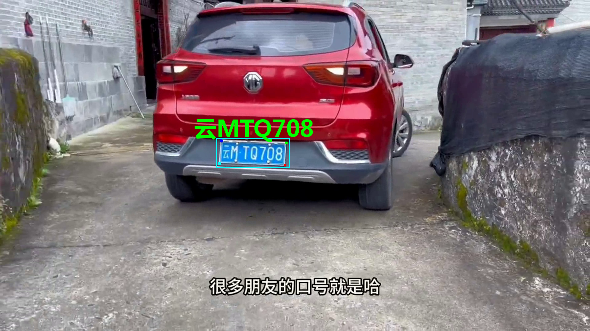

# License Plate Detection + Recognition.

This repository provides a end2end solution for car license plate detection and recognition.

## Requirements

To set up the environment, clone the repository and install the necessary packages:

```bash
conda create --name det_rec_conda

conda activate det_rec_conda

pip3 install ipykernel

python3 -m ipykernel install --user --name det_rec_conda --display-name det_rec_conda

pip3 install -r requirements.txt
```

## Data

The [demo.mp4](./demo.mp4) from Internet (Only for demo purpose)

Please prepare your own video clip for demo.

## Usage

To run the model on a video, use the following command:

```bash
python3 ./dect_rect_license.py
```

The scripts will save the visualized clip.

### Visualized Image



*Note: This is a demonstration. For higher accuracy, please customize the training strategy.*

## References
The detection and recognition onnx models are exported from torch weights. 

The detection torch weight is from [HyperLPR3](https://github.com/szad670401/HyperLPR)

The recognition torch weight is from [Chinese_license_plate_detection_recognition](https://github.com/we0091234/Chinese_license_plate_detection_recognition.git)

